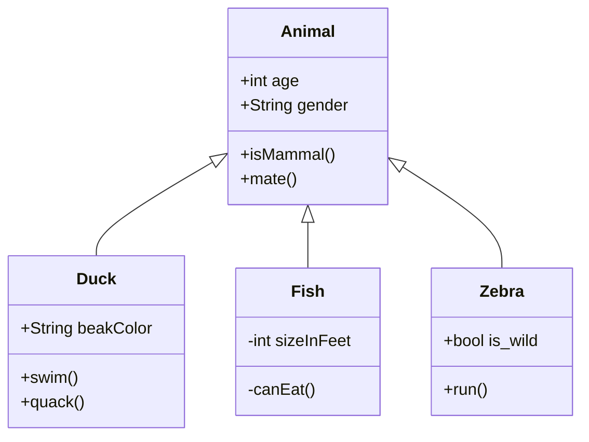

## 一. 博客简介

主要记录一些奇思妙想和算法学习、论文阅读笔记。

| 页面    | 内容                                              |
| ------- | ------------------------------------------------- |
| Home    | 展示博客简介和最新博客文章                        |
| About   | 个人介绍、教育背景、项目和论文情况。              |
| Archive | 对所有博客以日期进行归档划分，支持通过tag分类筛选 |
| Links   | 友情链接，可以展示自己其他平台的链接              |
| Search  | 搜索功能，根据关键词搜索所有满足条件的文章        |
| Post    | 以Markdown形式展示每篇文章的详细内容              |

### 首页

首页由顶部导航栏、博客简介、个人博客列表组成，右下角有light/reading/night切换、回到顶部和回到底部功能，同时以百分比的形式显示当前观看进度。


### 关于


### 归档


### 链接


### 搜索


### 详情页

和首页布局基本一致，把首页的博客简介替换成了文章简介，文章列表替换成了文章内容，右边还添加了文章目录，可以快速索引定位。


## 二. 功能实现

本次博客主要实现了以下几个功能：

① 日间模式、夜间模式和阅读模式的切换

② 对文章打标签，并通过标签来找到文章

③ 在发布时间上对文章进行排序

④ 可以通过关键词搜索文章

⑤ 可以通过登录github帐号对文章进行评论


### Markdown 附加功能

#### 数学公式渲染

支持使用 [Mathjax](https://github.com/mathjax/MathJax) 或 [Katex](https://github.com/KaTeX/KaTeX) 来在文章中渲染数学公式。

Katex 渲染速度快于 Mathjax（可以参考[这里](https://katex.org/)），但支持的 Tex 公式少于 Mathjax（[这里](https://katex.org/docs/supported.html)是 Katex 支持的公式列表）。

如果 `_config.yml` 中 `math.enable: false`，则只有 Front-matter 中添加了 `mathjax: true` 的文章才会开启公式渲染：

```yaml
---
layout: post
mathjax: true
---

```

否则所有文章（包括 `post` 和 `keynote`）中都会开启此功能。

示例：

Inline math: $ E = mc^2 $

Display math:

$$
i \hbar \frac{\partial \psi}{\partial t}
= \frac{-\hbar^2}{2m} ( \frac{\partial^2}{\partial x^2} + \frac{\partial^2}{\partial y^2} + \frac{\partial^2}{\partial z^2} ) \psi + V \psi
$$

```plaintext
$ E = mc^2 $
 
$$
i \hbar \frac{\partial \psi}{\partial t}
= \frac{-\hbar^2}{2m} ( \frac{\partial^2}{\partial x^2} + \frac{\partial^2}{\partial y^2} + \frac{\partial^2}{\partial z^2} ) \psi + V \psi
$$
```

#### 图表

##### Chart.js

使用了 [Chart.js](https://github.com/chartjs/Chart.js){:target="_blank"} 以在文章中加入可交互的图表。可以参考 [Chart.js 文档](https://www.chartjs.org/docs/latest/){:target="_blank"}来创建表格。

示例：


```chart
{
    "type": "bar",
    "data": {
        "labels": ["Red", "Blue", "Yellow", "Green", "Purple", "Orange"],
        "datasets": [{
            "label": "# of Votes",
            "data": [12, 19, 3, 5, 2, 3],
            "backgroundColor": [
                "rgba(255, 99, 132, 0.2)",
                "rgba(54, 162, 235, 0.2)",
                "rgba(255, 206, 86, 0.2)",
                "rgba(75, 192, 192, 0.2)",
                "rgba(153, 102, 255, 0.2)",
                "rgba(255, 159, 64, 0.2)"
            ],
            "borderColor": [
                "rgba(255, 99, 132, 1)",
                "rgba(54, 162, 235, 1)",
                "rgba(255, 206, 86, 1)",
                "rgba(75, 192, 192, 1)",
                "rgba(153, 102, 255, 1)",
                "rgba(255, 159, 64, 1)"
            ],
            "borderWidth": 1
        }]
    },
    "options": {
        "scales": {
            "yAxes": [{
                "ticks": {
                    "beginAtZero": true
                }
            }]
        }
    }
}
```

<pre><code class="json">```chart
{
    "type": "bar",
    "data": {
        "labels": ["Red", "Blue", "Yellow", "Green", "Purple", "Orange"],
        "datasets": [{
            "label": "# of Votes",
            "data": [12, 19, 3, 5, 2, 3],
            "backgroundColor": [
                "rgba(255, 99, 132, 0.2)",
                "rgba(54, 162, 235, 0.2)",
                "rgba(255, 206, 86, 0.2)",
                "rgba(75, 192, 192, 0.2)",
                "rgba(153, 102, 255, 0.2)",
                "rgba(255, 159, 64, 0.2)"
            ],
            "borderColor": [
                "rgba(255, 99, 132, 1)",
                "rgba(54, 162, 235, 1)",
                "rgba(255, 206, 86, 1)",
                "rgba(75, 192, 192, 1)",
                "rgba(153, 102, 255, 1)",
                "rgba(255, 159, 64, 1)"
            ],
            "borderWidth": 1
        }]
    },
    "options": {
        "scales": {
            "yAxes": [{
                "ticks": {
                    "beginAtZero": true
                }
            }]
        }
    }
}
```
</code></pre>

`注意`{:.warning}：`json` 中的 `key` 值一定要加**引号**，否则会渲染出错。


##### mermaid

使用了 [mermaid](https://github.com/knsv/mermaid){:target="_blank"} 以在文章中加入流程图、状态图、时序图、甘特图等。可以参考 [mermaid 文档](https://mermaid-js.github.io/mermaid/){:target="_blank"}来创建图。

示例：



    ```mermaid
    classDiagram
        Animal <|-- Duck
        Animal <|-- Fish
        Animal <|-- Zebra
        Animal : +int age
        Animal : +String gender
        Animal: +isMammal()
        Animal: +mate()
        class Duck{
            +String beakColor
            +swim()
            +quack()
        }
        class Fish{
            -int sizeInFeet
            -canEat()
        }
        class Zebra{
            +bool is_wild
            +run()
        }
    ```


#### 标签

`消息标签`{:.info}

```markdown
`消息标签`{:.info}
```

`成功标签`{:.success}

```markdown
`成功标签`{:.success}
```

`警告标签`{:.warning}

```markdown
`警告标签`{:.warning}
```

`错误标签`{:.error}

```markdown
`错误标签`{:.error}
```

#### 提示

消息提示文案
{:.info}

```markdown
消息提示文案
{:.info}
```

成功提示文案
{:.success}

```markdown
成功提示文案
{:.success}
```

警告提示文案
{:.warning}

```markdown
警告提示文案
{:.warning}
```

错误提示文案
{:.error}

```markdown
错误提示文案
{:.error}
```

#### 表情
##### emoji

使用了 [jemoji](https://github.com/jekyll/jemoji){:target="_blank"} 插件以在文章中插入 emoji，需要手动安装这个插件：

```bash
gem install jemoji
```

从[这里](https://pages.github.com/versions/){:target="_blank"}可以看到 Github Pages 上自带 jemoji 插件。[这里](https://www.webfx.com/tools/emoji-cheat-sheet/){:target="_blank"}是所有 emoji 的代码。

示例：

:smile: :smirk: :racehorse: :wolf:

```markdown
:smile: :smirk: :racehorse: :wolf:
```

##### 附加表情

也可以在文章中插入其他表情，目前支持 Bilibili 的小电视表情 `斜眼笑`{:.emoji-plus}（效果出乎意料的好）。

示例：

`斜眼笑`{:.emoji-plus} `doge`{:.emoji-plus} `白眼`{:.emoji-plus}

```markdown
`斜眼笑`{:.emoji-plus} `doge`{:.emoji-plus} `白眼`{:.emoji-plus}
```

## 三. 搭建过程

### 创建github仓库


从 GitHub 克隆项目：

```bash
git clone https://github.com/Renovamen/jekyll-theme-gungnir.git
cd jekyll-theme-gungnir
```

本地运行需要参考[这里](https://jekyllrb.com/docs/installation/)安装 Ruby 和 Jekyll。然后安装依赖包：

```bash
bundle config set path 'vendor/bundle'
bundle install
```

然后即可本地预览：

```bash
bundle exec jekyll serve --watch
```

### 导航菜单

一级菜单的配置如下：

```yaml
menus:
  - title: Home
    font: fab fa-fort-awesome
    url: /
  - title: Archive
    font: fas fa-archive
    url: /archive/
```

需要填入每个页面的名称、路径和图标。图标库使用了 [Font Awesome](https://fontawesome.com/)，可以在[这里](https://fontawesome.com/icons)查找图标。

如果要添加**二级菜单**，则需要在需要添加二级菜单的一级菜单下添加 `submenus` 关键字，然后在 `submenus` 下填入每个二级菜单页面的名称、路径和图标：

```yaml
menus:
  - title: About
    font: fas fa-paw
    submenus:
      - title: Me
        font: fas fa-user-astronaut
        url: /about/
```

### 评论功能

#### Gitalk

注册一个 [Github Application](https://github.com/settings/applications/new) 并搞到 Client ID 和 Client Secret，然后填入对应信息：


```yaml
comment: 
  provider: gitalk
  gitalk:
    clientID: # Github Application Client ID
    clientSecret: # Github Application Client Secret
    repo: # 用来放评论的 Github 仓库
    owner: # 上述 Github 仓库的拥有者 ID
    admin: 
      - 管理员1
      - 管理员2
      - ...
```

此处参考 [Gitalk 文档](https://github.com/gitalk/gitalk)

## 四. 技术选择

### Jekyll

1. **简单易用**：Jekyll是一个简单易用的静态网站生成器，特别适合用来搭建博客。它使用Markdown语法编写文章，生成静态网页，无需复杂的后台配置。
2. **快速部署**：Github Pages提供了免费的静态网站托管服务，可以直接将Jekyll生成的静态网页部署到Github上，无需购买额外的主机服务。
3. **社区支持**：Jekyll有庞大的社区支持，有大量的文档和教程可供参考，遇到问题时可以很容易地找到解决方案。

### CSS

- [Bootstrap](https://github.com/twbs/bootstrap)
- [Font Awesome](https://github.com/FortAwesome/Font-Awesome)
- [Font Awesome Animation](https://github.com/l-lin/font-awesome-animation)

### JavaScript

- [jQuery](https://github.com/jquery/jquery)
- [ScrollReveal](https://github.com/jlmakes/scrollreveal)（图片模式下文章列表上浮效果，About 页面的时间轴上浮效果）
- [Tocbot](https://github.com/tscanlin/tocbot)（文章目录）
- [AnchorJS](https://github.com/bryanbraun/anchorjs/)（文章锚点）
- [Gitalk](https://github.com/gitalk/gitalk)（Gitalk 评论）
- [Chart.js](https://github.com/chartjs/Chart.js)（[图表](https://fiveneves.github.io/theme/#chartjs)）
- [mermaid](https://github.com/mermaid-js/mermaid)（[图表](https://fiveneves.github.io/theme/#mermaid)）
- [MathJax](https://github.com/mathjax/MathJax)（公式渲染）
- [Katex](https://github.com/KaTeX/KaTeX) （公式渲染）
- [hightlight.js](https://github.com/highlightjs/highlight.js) （代码高亮渲染）
- [hightlight-line-number.js](https://github.com/wcoder/highlightjs-line-numbers.js/) （给 hightlight.js 生成的代码块加行号的插件）
- [Simple-Jekyll-Search](https://github.com/christian-fei/Simple-Jekyll-Search)（搜索）
- [fastclick](https://github.com/ftlabs/fastclick)（解决移动设备上的点击延迟问题）

## 五. 遇到的问题及其解决方法

### 1. 本地环境配置

通过 RubyInstaller 安装[固定链接](https://jekyllrb.com/docs/installation/windows/#installation-via-rubyinstaller)

安装 Ruby 和 Jekyll 的最简单方法是使用适用于 Windows 的 [RubyInstaller](https://rubyinstaller.org/)。

RubyInstaller 是一个独立的基于 Windows 的安装程序，包括 Ruby 语言、执行环境、 重要文档等。

1. 从 [RubyInstaller 下载](https://rubyinstaller.org/downloads/)下载并安装 **Ruby+Devkit** 版本。 使用默认选项进行安装。
2. 在安装向导的最后阶段运行该步骤。这是使用本机安装 Gem 所必需的 扩展。您可以在 [RubyInstaller 文档](https://github.com/oneclick/rubyinstaller2#using-the-installer-on-a-target-system)中找到有关此内容的其他信息。 从选项中选择 。`ridk install``MSYS2 and MINGW development tool chain`
3. 从“开始”菜单打开新的命令提示符窗口，以便对环境变量的更改生效。 使用 Jekyll 和 Bundler 安装`PATH``gem install jekyll bundler`


检查 Jekyll 是否已正确安装：`jekyll -v`


### 2. 文章展示数学公式

问题：遇到数学公式加载不成功的情况

解决方法：查看官方文档[加载和配置 MathJax — MathJax 2.7 文档](https://docs.mathjax.org/en/v2.7-latest/configuration.html#)，在_includes/enhancements/mathjax.html内联配置中修改行内公式和行间公式规则


